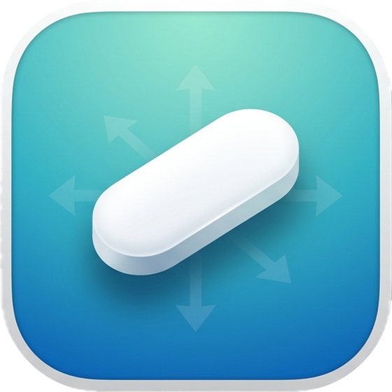

<p align="center">
  
</p>

# PillFloat

Reposition the [Wispr Flow](https://wispr.com) dictation pill anywhere on your screen. Free, open-source, no fuss.

Wispr Flow's dictation pill is stuck at the bottom-center of your screen. It gets in the way of browser tabs, terminals, video calls, presentation controls... you name it. PillFloat lets you move it wherever you want.

> This is not affiliated with or endorsed by Wispr. It's a small utility that uses the macOS Accessibility API to reposition their dictation indicator. Wispr Flow is great, this just makes one thing about it better.

<!-- TODO: Add screenshot of settings window + menu bar here -->

## Features

- **Preset positions** — Default (native), Top Left/Center/Right, Bottom Left/Center/Right
- **Drag to move** — Grab the pill and drag it anywhere on screen
- **Visual picker** — Minimap in Settings where you drag a pill to set a custom spot
- **Launch at Login** — Starts automatically, stays out of your way
- **Update checker** — Checks GitHub for new versions, shows `brew upgrade` command with one-click copy (opt-in, no telemetry)
- **In-app uninstall** — Menu bar or Settings → removes the app, clears settings, disables login item
- **Settings window** — Opens on first launch, accessible anytime via menu bar or by relaunching from Spotlight

## Installation

Pick **one** method. Don't mix them — Homebrew and `make install` both write to `/Applications` and don't know about each other.

### Homebrew (recommended)

```bash
brew tap OrangeAKA/tap
brew install --cask pillfloat
```

Done. Find "PillFloat" in Spotlight and launch it.

To update: `brew upgrade --cask pillfloat`
To uninstall: `brew uninstall --cask pillfloat`

### Build from source

Requires macOS 13+ and Xcode Command Line Tools (`xcode-select --install`).

```bash
git clone https://github.com/OrangeAKA/pillfloat.git
cd pillfloat
make install
```

This builds the `.app` and copies it to `/Applications`.

To uninstall: `make uninstall`

> **Note:** `make install` will refuse to run if PillFloat is already installed via Homebrew, and vice versa.

### macOS Gatekeeper

Since PillFloat isn't signed with an Apple Developer certificate, macOS may block it on first launch.

**Homebrew users:** This is handled automatically. No action needed.

**Manual/source install:** Right-click the app in Finder → "Open" → click "Open" in the dialog (one-time), or run:
```bash
xattr -rd com.apple.quarantine /Applications/PillFloat.app
```

### Accessibility permission

On first launch, macOS will ask you to grant Accessibility access. Go to **System Settings → Privacy & Security → Accessibility** and enable PillFloat.

This is required — PillFloat uses the Accessibility API to find and move the pill window.

**After updates:** macOS may invalidate the Accessibility permission when the binary changes (common with unsigned apps). If drag or repositioning stops working after an update, PillFloat will detect this and show instructions to fix it. The quick fix: toggle PillFloat off and back on in System Settings → Accessibility. PillFloat auto-recovers within seconds, no restart needed.

## Usage

1. Launch PillFloat — settings window opens on first launch
2. Pick a preset, drag the pill on the minimap, or drag the actual pill on screen
3. Your position saves automatically and persists across sessions

**Menu bar** — Click the icon for quick preset switching, "Settings..." (⌘,), enable/disable toggle, or quit.

**Drag to move** — During dictation, click the pill and drag it. Position saves on release.

**Relaunching** — If PillFloat is already running and you open it from Spotlight, the settings window pops up.

## Limitations

### Top positions are approximate

Wispr Flow renders the pill inside a ~440×300px transparent window. The visible pill is a small element (~70px) at the bottom. macOS won't let a window go above the screen edge, so "Top Right" actually lands in the upper quarter, not flush against the menu bar.

Bottom positions work precisely. Drag gives you the most control.

### Brief flicker

Wispr Flow resets the pill position every ~400ms. PillFloat overrides every 150ms. You may occasionally see a brief flash to bottom-center before it snaps back.

### Wispr Flow updates

PillFloat finds the pill by its window title ("Status"). If Wispr changes this in an update, detection may break until PillFloat is updated.

### Background activity

PillFloat shows up in System Settings → Login Items & Background Activity. Normal for menu bar apps. Uses ~0.1% CPU, only active while Wispr Flow is running.

### Privacy

PillFloat stores only your position preference and a "last update check" timestamp locally. The update checker makes a single GET request to the GitHub API. No telemetry, no tracking, no data collection. You can disable the update checker in Settings.

## Troubleshooting

### PillFloat isn't moving the pill / drag doesn't work

This is almost always an Accessibility permission issue. PillFloat will show an alert on launch if it detects a stale permission, but if you missed it:

1. Open **System Settings → Privacy & Security → Accessibility**
2. Select PillFloat in the list and click the **−** (minus) button to remove it
3. Relaunch PillFloat — it will prompt you to re-add it
4. Click **"Open Accessibility Settings"** in the prompt, or go to Accessibility manually
5. Toggle PillFloat **ON**
6. PillFloat starts working within a few seconds, no restart needed

**Why does this happen?** PillFloat isn't signed with an Apple Developer certificate. macOS tracks Accessibility permissions by the app's binary hash. When the binary changes (after an update), the old permission becomes stale. macOS still shows the app as "enabled" but the permission doesn't actually work. Homebrew installs handle this automatically by clearing the stale entry, but manual installs may need the steps above.

### PillFloat shows "Accessibility: Needs refresh" in Settings

Same fix as above. Click the **Fix...** button next to the status, which opens Accessibility Settings directly. Toggle PillFloat off and back on.

### Pill briefly flickers to the wrong position

Wispr Flow resets the pill position every ~400ms. PillFloat overrides every 150ms. You may occasionally see a brief flash to bottom-center before it snaps back. This is a limitation of how Wispr Flow works and can't be fully eliminated.

### Uninstalling via the app when installed with Homebrew

The in-app uninstall removes the `.app` from Applications but can't clean up Homebrew's records. If you installed via Homebrew, use:

```bash
brew uninstall --cask pillfloat
```

The uninstall dialog reminds you of this.

## Built with

Swift, AppKit, ApplicationServices (Accessibility API), ServiceManagement, URLSession. No external dependencies.

| File | What it does |
|---|---|
| `main.swift` | Entry point, single-instance detection |
| `AppDelegate.swift` | Menu bar, settings window, update notifications, uninstall |
| `PillWatcher.swift` | Core — AX window detection, repositioning, drag handling |
| `PreferredPosition.swift` | Presets, custom coords, persistence |
| `SettingsWindow.swift` | Settings UI with presets, minimap, toggles |
| `ScreenUtility.swift` | Screen geometry, coordinate conversion |
| `UpdateChecker.swift` | GitHub release API, version comparison |
| `AXPermissionChecker.swift` | Runtime Accessibility permission validation |

## Requirements

- macOS 13 (Ventura) or later
- [Wispr Flow](https://wispr.com) installed
- Accessibility permission

## Contributing

Contributions welcome! See [CONTRIBUTING.md](CONTRIBUTING.md) for guidelines.

If something is broken or you have an idea, [open an issue](https://github.com/OrangeAKA/pillfloat/issues).

## License

[MIT](LICENSE)
